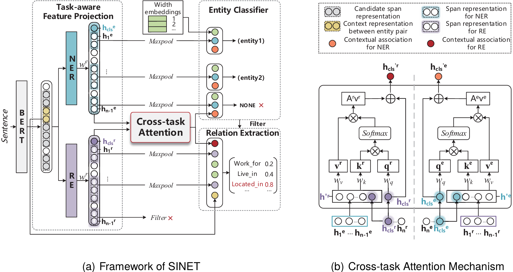

# RTE-SINET
The Dataset and code for paper Synergetic Interaction Network with Cross-task Attention for Joint Relational Triple Extraction accepted by The 2024 Joint International Conference on Computational Linguistics (COLING 2024).

## 1 Procedure

### 1.1 Python Function Libraries

Install the python function libraries required by the model in requirements.txt

- Libraries that must be installed and meet version requirements
  - Python 3.5+
  - PyTorch (tested with version 1.4.0)
  - transformers (+sentencepiece, e.g. with 'pip install transformers[sentencepiece]', tested with version 4.1.1)
  - scikit-learn (tested with version 0.24.0)
  - tqdm (tested with version 4.55.1)
  - numpy (tested with version 1.17.4)
- Optional libraries to install
  - jinja2 (tested with version 2.10.3) - Used to output relation extraction samples
  - tensorboardX (tested with version 1.6) - Use tensorboard to save the training process
  - spacy (tested with version 3.0.1) - For encoding sentences on unlabeled data

### 1.2 Load Model

Set the values ​​of `model_path` and `tokenizer_path` in the ./configs/example_train.conf file to `bert-base-cased` and `scibert_scivocab_cased`. The pre-training model comes from [bert-base-cased · Hugging Face](https://huggingface.co/google-bert/bert-base-cased) and [scibert_scivocab_cased · Hugging Face](https://huggingface.co/allenai/scibert_scivocab_cased/tree/main)

### 1.3 Model Training And Evaluation

#### 1.3.1 Model Training

Run the model. For model training, use the following command
~~~
python ./spert.py train --config configs/example_train_v1.conf
~~~

The trained model is stored in .data/save/

#### 1.3.2 Model Testing

In order to evaluate the model, you need to modify the values ​​of `model_path` and `tokenizer_path` in ./configs/example_eval.conf to the specific storage location of the model, and then run the following command

~~~
python ./spert.py eval --config configs/example_eval_v1.conf
~~~

#### 1.3.3 Model Output

The overall test results of the model (including precision, recall and f1 score of each entity type and relationship type) can be reflected on the console of the input command after the model test run is completed. For more specific model output information statistics, you can Check in the corresponding file in the ./data/log/ directory.

## 2 Dataset

We preprocess data and due to copyright issues, we only use publicly available and free data sets for demonstration.

In each file, all sample data are placed in a list. Each sample data is saved in the form of a dictionary. The keys of the dictionary consist of `tokens`, `entities`, and `relations`. Examples of sample data are as follows:

~~~
{"tokens": ["Recognition", "of", "proper", "nouns", "in", "Japanese", "text", "has", "been", "studied", "as", "a", "part", "of", "the", "more", "general", "problem", "of", "morphological", "analysis", "in", "Japanese", "text", "processing", "(", "[", "1", "]", "[", "2", "]", ")", "."], "entities": [{"type": "Task", "start": 0, "end": 4}, {"type": "OtherScientificTerm", "start": 2, "end": 4}, {"type": "Material", "start": 5, "end": 7}, {"type": "Task", "start": 19, "end": 21}, {"type": "Task", "start": 22, "end": 25}], "relations": [{"type": "Part-of", "head": 0, "tail": 3}, {"type": "Part-of", "head": 1, "tail": 2}, {"type": "Used-for", "head": 3, "tail": 4}]}
~~~

`start` and `end` in entities `entities` represent the positions of starting character and the position next to the position ending character positions respectively.
`head` and `tail` in the relationship `relations` respectively mark the positions of the head entity and the tail entity in the `entities` list

If you want to switch different data sets for testing, you need to first train the model of the corresponding data set, and then modify the values ​​of `train_path`, `valid_path`

`types_path` in each configuration file in ./configs/ to the corresponding data set location. , and `model_path`, the value of `tokenizer_path` is the position of the corresponding trained model.

## Citation

@inproceedings{luo-etal-2024-synergetic-interaction,
    title = "Synergetic Interaction Network with Cross-task Attention for Joint Relational Triple Extraction",
    author = "Luo, Da  and
      Lin, Run  and
      Liu, Qiao  and
      Cai, Yuxiang  and
      Liu, Xueyi  and
      Gan, Yanglei  and
      Hou, Rui",
    booktitle = "Proceedings of the 2024 Joint International Conference on Computational Linguistics, Language Resources and Evaluation (LREC-COLING 2024)",
    month = may,
    year = "2024",
    address = "Torino, Italy",
    publisher = "ELRA and ICCL",
    url = "https://aclanthology.org/2024.lrec-main.1343",
    pages = "15457--15468",
}

